# ChainSOC -- Prototype de SOC Distribué

---

## 1. Objectif du projet

ChainSOC est un prototype de centre de sécurité (SOC) distribué.

L'objectif est simple : automatiser la surveillance des logs entre plusieurs machines, détecter les activités suspectes, générer des alertes, et stocker les logs de manière sécurisée.

Le système repose sur trois machines virtuelles qui communiquent entre elles via SSH.

---

## 2. Architecture

Le projet utilise trois machines virtuelles interconnectées sur un réseau local :

| Machine   | Rôle                                            |
|-----------|--------------------------------------------------|
| Target    | Génère les logs et simule des activités suspectes |
| Watcher   | Surveille, détecte les menaces, génère des alertes |
| Vault     | Reçoit et stocke les logs de manière sécurisée    |

```
Target                    Watcher                    Vault
(génère les logs)  --->  (récupère + analyse)  --->  (stocke les logs)
                          |
                          v
                     alerts.txt
```

---

## 3. Ce que nous avons réalisé

### Étape 1 -- Configuration réseau

Les trois machines virtuelles ont été configurées sur le même réseau local avec des adresses IP statiques. La connectivité entre toutes les machines a été testée et validée.

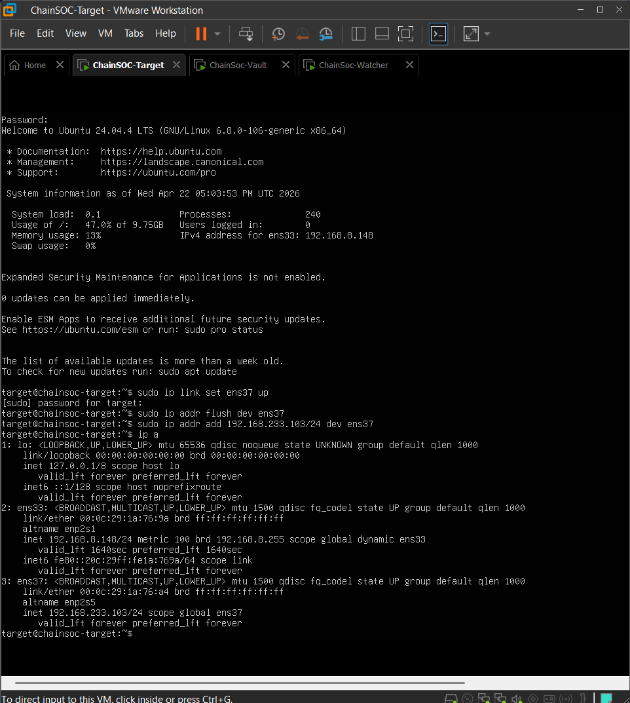


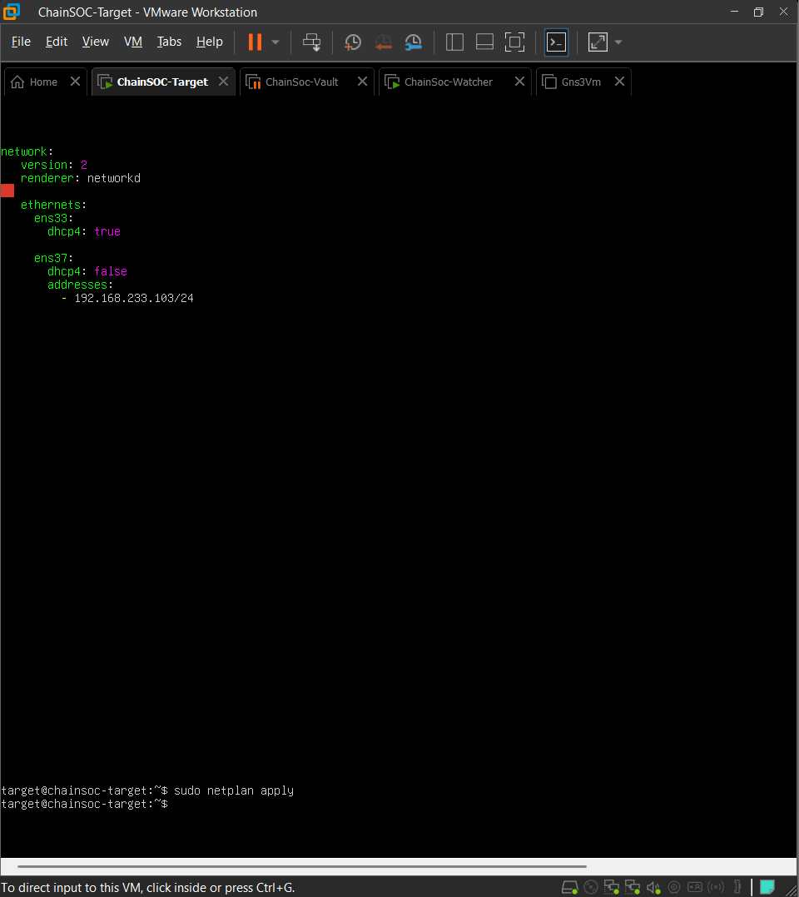

### Étape 2 -- Communication SSH

SSH a été installé et activé sur toutes les machines. Pour éviter de saisir un mot de passe à chaque connexion, nous avons mis en place une authentification par clé SSH avec `ssh-keygen` et `ssh-copy-id`. Cela permet au Watcher de se connecter automatiquement à Target et à Vault sans intervention humaine.


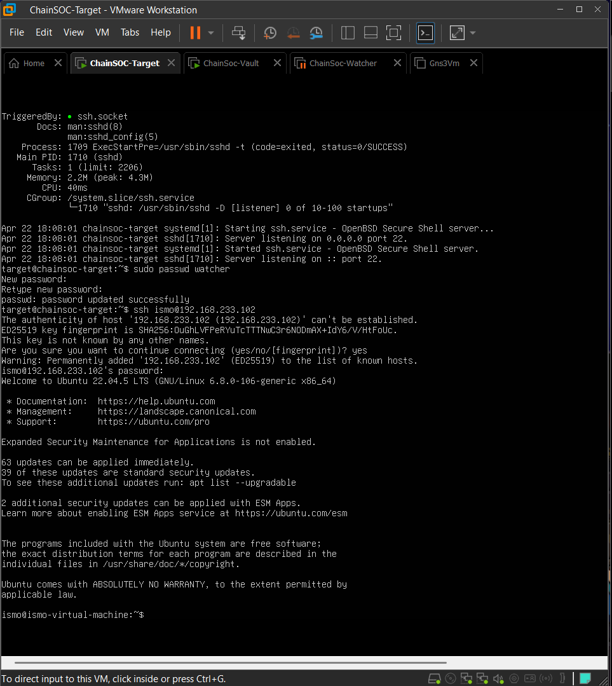

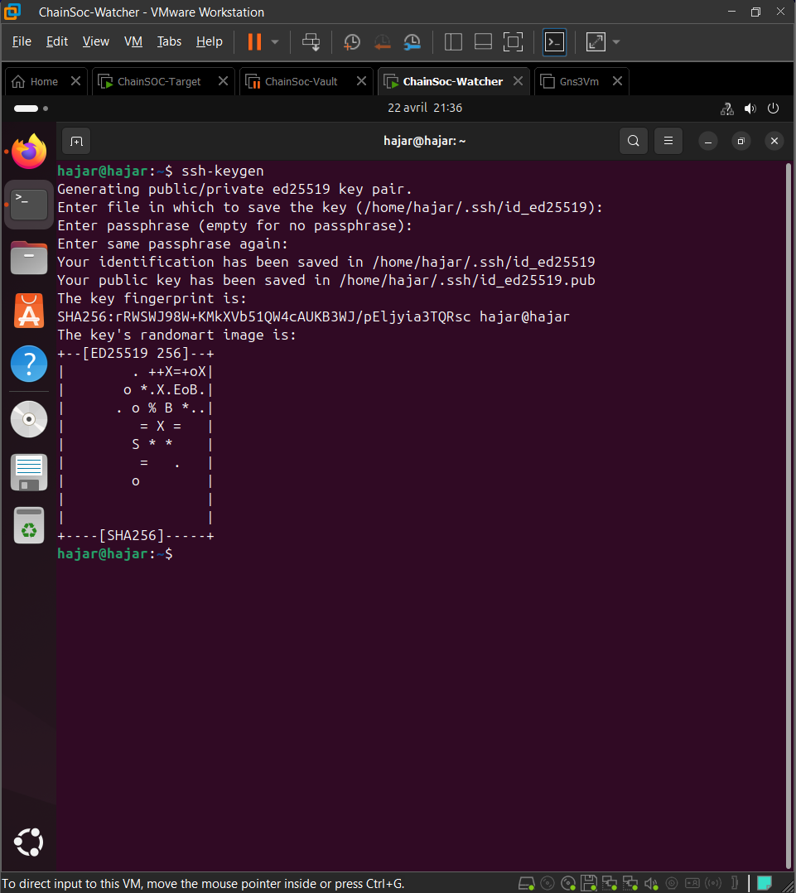

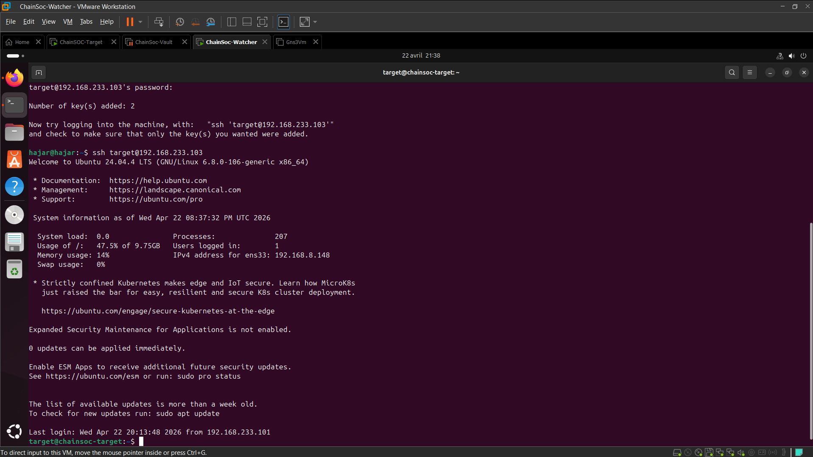


### Étape 3 -- Génération de logs sur Target

Sur la machine Target, nous utilisons la commande `logger` pour générer des logs de test dans le journal système. Ces logs simulent une activité suspecte que le Watcher doit détecter.

```bash
logger "chainsoc_test_ALERT"
```

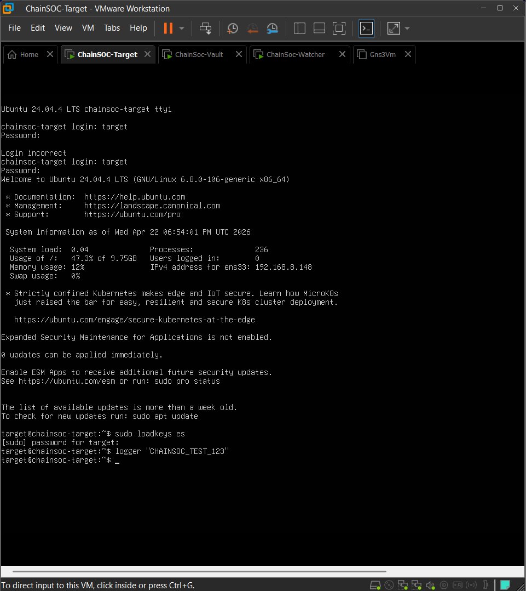

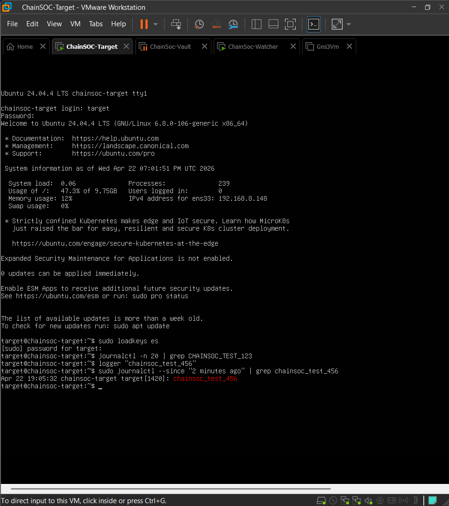


### Étape 4 -- Récupération automatique des logs

Le script `check_logs.sh` sur le Watcher se connecte à Target via SSH et récupère les logs récents contenant le mot clé `chainsoc_test`.


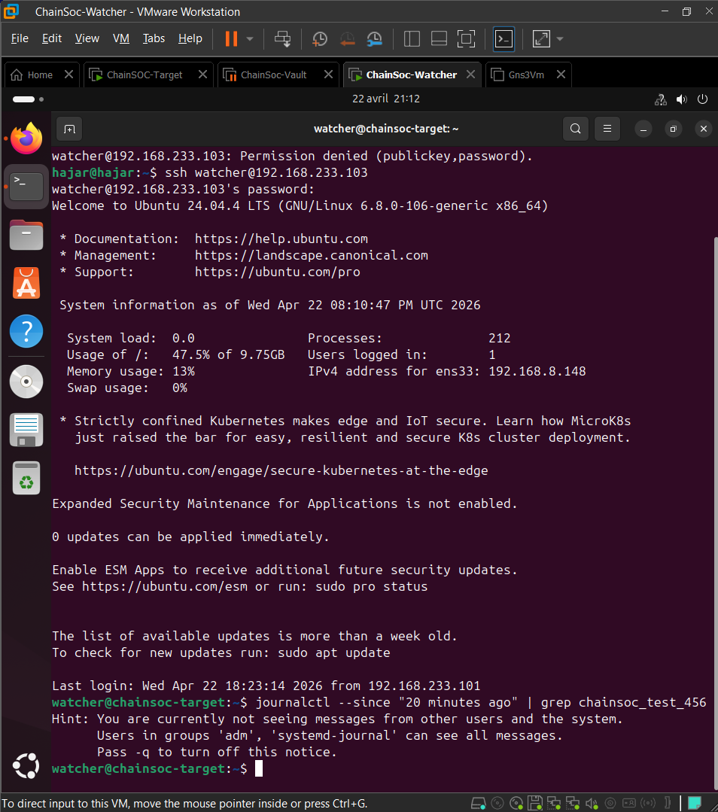

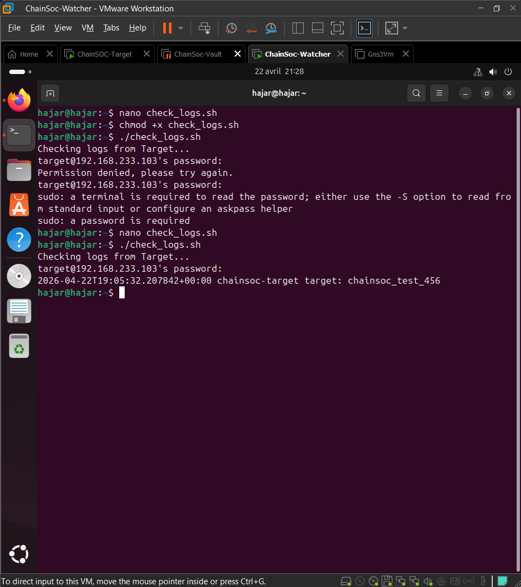


### Étape 5 -- Envoi automatique vers Vault

Le script `send_to_vault.sh` fait tout en une seule exécution : il récupère les logs, vérifie si un log suspect est présent, génère une alerte si nécessaire, et envoie le log vers la machine Vault.


### Étape 6 -- Génération d'alertes

Quand le script détecte un log suspect, il affiche `"ALERT: Suspicious log detected!"` et enregistre le log dans `alerts.txt` sur le Watcher.


### Étape 7 -- Automatisation avec cron

Le script `send_to_vault.sh` a été ajouté au planificateur cron pour s'exécuter chaque minute :

```bash
* * * * * /home/hajar/send_to_vault.sh
```

Chaque minute, le système exécute automatiquement : récupération des logs, détection, création d'alertes, envoi et stockage.

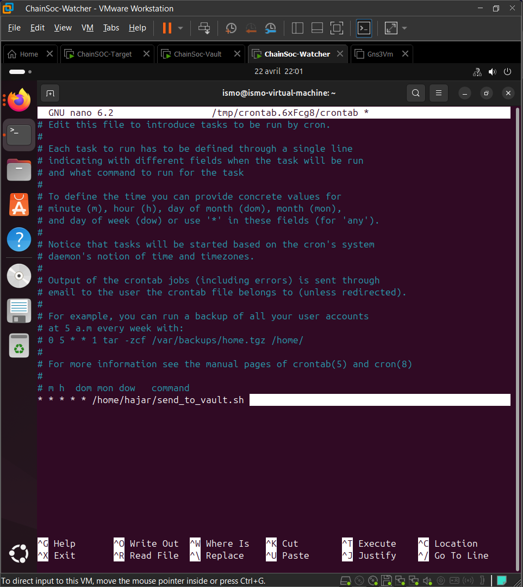


---

## 4. Scripts créés

| Script              | Fonction                                                    |
|---------------------|-------------------------------------------------------------|
| `check_logs.sh`     | Récupère les logs récents depuis Target via SSH              |
| `send_to_vault.sh`  | Détecte les logs suspects, génère des alertes, envoie vers Vault |

---

## 5. Test du système

Pour prouver que l'automatisation fonctionne, nous avons réalisé le test suivant :

**1.** Générer un log suspect sur Target :

```bash
logger "chainsoc_test_FINAL"
```

**2.** Attendre une minute (le temps que le cron s'exécute).

**3.** Vérifier les alertes sur Watcher :

```bash
cat alerts.txt
```

**4.** Vérifier le stockage sur Vault :

```bash
cat vault_logs.txt
```

Le log suspect a été détecté, l'alerte a été créée, et le log a été stocké sur Vault automatiquement. Ce test prouve que le système fonctionne de bout en bout sans intervention manuelle.


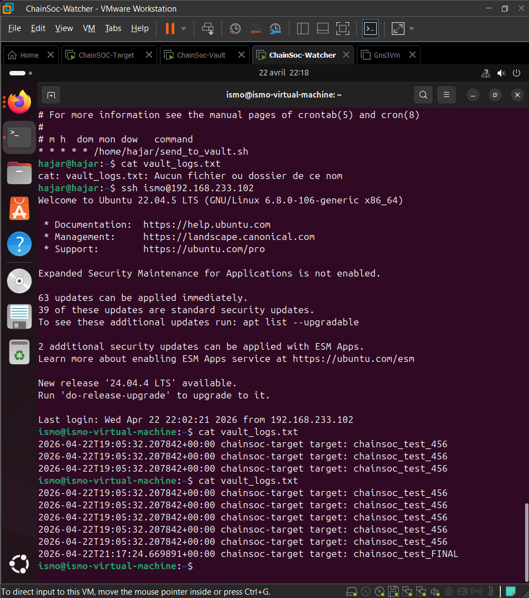

---

## 6. Résultat final

Le pipeline automatisé fonctionne comme suit :

```
Target génère un log
      |
      v
Watcher récupère le log automatiquement
      |
      v
Watcher détecte l'activité suspecte
      |
      v
Watcher génère une alerte (alerts.txt)
      |
      v
Watcher envoie le log vers Vault
      |
      v
Vault stocke le log (vault_logs.txt)
```

Tout ce cycle s'exécute automatiquement chaque minute.

---

## 7. Limites actuelles

Les composants suivants sont des implémentations temporaires utilisées pour valider le fonctionnement du système :

| Composant         | Statut                               |
|-------------------|--------------------------------------|
| `alerts.txt`      | Stockage temporaire des alertes       |
| `vault_logs.txt`  | Stockage temporaire des logs sur Vault |

Ces fichiers texte ont permis de tester et prouver le bon fonctionnement de l'automatisation.

---

## 8. Améliorations futures

- **IPFS** -- Stockage décentralisé des logs
- **Blockchain** -- Enregistrement des logs pour garantir leur intégrité
- **Smart contracts** -- Vérification automatique via des contrats intelligents
- **Dashboard** -- Interface de visualisation en temps réel

---

## Conclusion

ChainSOC démontre un prototype fonctionnel de SOC distribué. Le système collecte automatiquement les logs, détecte les activités suspectes, génère des alertes et stocke les données, le tout sans intervention manuelle. L'automatisation complète a été validée par des tests concrets.
